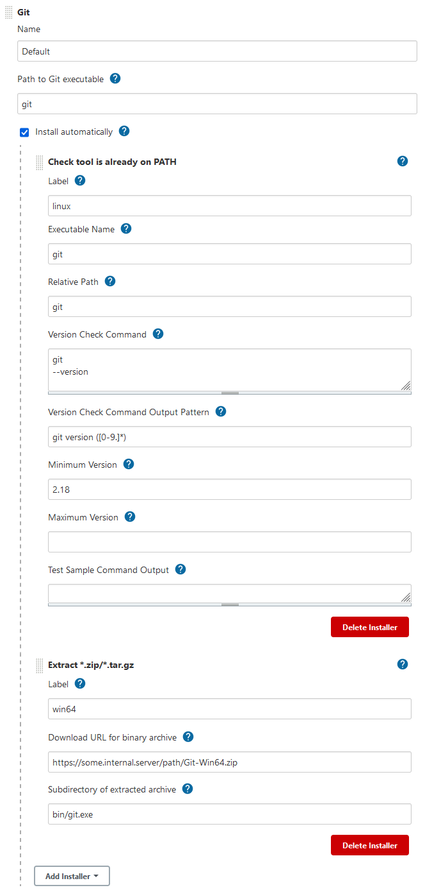

# Extra Tool Installers plugin for Jenkins

## Features

Plugin provides following installers:

* Batch command installer for Windows.
  * This is functionally similar to the core code BatchCommandInstaller,
    but this one performs variable substitution on the batch script before it is executed.
  * Useful when you want your installation script to take node-specific variables into account.
* Install from a specified folder  
  * Setup without any actions. e.g. where the "installation" already exists.
    * Useful when a tool is pre-installed on nodes matching a particular label expression
* Skip or fail installation  
  * Prints warnings during the installation and/or fails the installation
    * Useful when a tool is not available on nodes matching a particular label expression
* Download (with basic authentication) and extract a zip/tar.gz
  * This is functionally similar to the core code
    "Extract .zip/.tar.gz" installer,
    but this supports HTTP Basic Authentication for the download.
    * Useful when you need to download from servers that do not permit anonymous downloads.
* Try any of ...
  * Used to try (and possibly re-try) one or more nested installers until one succeeds.
  * Useful when using
    e.g.
    Extract .zip/tar.gz
    installers that are downloading from URLs which cannot be relied upon.
* Check tool is already on PATH
  * Does not install anything
  * Fails if the specified executable is not on the agent's PATH already
  * (Optionally) Fails if the executable is not an acceptable version.

## Example usage

The following examples use the
[Custom Tools](https://plugins.jenkins.io/custom-tools-plugin/)
plugin to illustrate the new installation methods.

### Linux-only
This example causes builds to fail if they require the "Very useful Linux tool" but are run on a node tagged with "windows".
Nodes tagged with "linux" put `${PATH_TO_THE_TOOL}` on the `$PATH` and `$LD_LIBRARY_PATH` before they continue on with the build.

### Coping with unreliable servers
This example defines a tool with two possible sources from which it can be downloaded.

1. Jenkins will start by attempting to download the tool from the first server, `https://some.unreliable.internal.server.com`,
done using an HTTP GET with basic authentication using the "myUser" credentials.
1. If that fails, Jenkins will attempt that URL once more (2 times total, as specified by the last field) before moving on to the next installer, which will also be attempted up to 2 times etc.
1. The whole set of installers will be looped through a total of 3 times (as specified by the last-but-one field) before giving up.

i.e. up to 12 download attempts in total (aabbaabbaabb)

### Install Git on Windows machines
This example uses the Check tool is already on PATH option to ensure that Git is already present on unix & linux machines at version 2.18 or later, but installs Git on Windows machines.

Note: Where an installation method for a Custom Tool definition (as shown earlier examples above) returns the directory containing the tool, the installation methods for a Git definition must return the location of the git client executable itself.
That's why this example specifies a "Relative Path" of "git" (and a "Subdirectory of extracted archive" of "bin/git.exe").

## See also
* [Software licence](LICENSE)
* Support and [contribution guide](CONTRIBUTING.md)
* [Version history](CHANGELOG.md)
